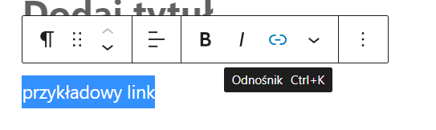

# Strona Złotej Ósemki - Poradnik dla Drużynowego
## 0. Wstęp
Masz przed sobą poradnik administrowania nową stroną Złotej Ósemki. Zmieniło się naprawdę dużo - razem z nową szatą graficzną weszły "pod spodem". Nie ma się jednak czego obawiać - nowy wordpress jest intuicyjny, a w razie problemu poradnik przeprowadzi Cię przez wszystkie najtrudniejsze momenty.
## 1. Logowanie
Jeśli to czytasz, prawdopodobnie jest już utworzone dla Ciebie konto.
Panel logowania dostępny jest pod adresem https://www.zlotaosemka.zhp.net.pl/wp-admin. Logujesz się swoim mailem ZHP i hasłem (które dostaniesz je na maila). Po zalogowaniu Twoim oczom ukaże się panel główny wordpressa

### 1.1. Po pierwszym logowaniu
Naszą przygodę ze stroną zaczniemy od ustawień profilu.  
Kliknij w przycisk "Profil" na panelu po lewej stronie. Ukaże się Tobie panel ustawień

Możesz ustawić tutaj wszystko - jednak przede wszystkim musisz ustawić nowe hasło.  
Kliknij przycisk "Ustaw nowe hasło" (Musisz troszkę przewinąć w dół aby go zobaczyć).
Wpisz nowe hasło w pole które się pojawi.
Pamiętaj aby po wszystkim kliknąć przycisk "Zapisz wszystkie zmiany" na dole strony.
## 2. Dodawanie artykułów
Aby dodać artykuł, musisz najpierw wejść do panelu dodawania wpisów. Aby to zrobić:
- Najedź myszką na przycisk "Wpisy" na panelu po lewej stronie
- W rozwijanym menu które się pojawi, kliknij przycisk "Dodaj nowy"

### 2.1 Tytuł i treść artykułu

- W miejsce "Wpisz tytuł" wpisujemy oczywiście tytuł
- W miejscu "Wciśnij / aby wybrać blok" wpisujemy treść naszego artykułu. Kliknięcie _enter_ utworzy nowy akapit.
### 2.2 Linki
- W treści artykułu możesz dodać również link. Jest to najlepsza opcja na dodanie do Twojego artykułu galerii (korzystamy ze zdjęć google, mamy bardzo ograniczone miejsce na serwerze chorągwi więc nie możemy ich dodawać bezpośrednio do artykułów)
- Aby dodać link, wpisz najpierw tekst. Później zaznacz go myszką i kliknij ikonkę linku (jak na zdjęciu poniżej)
- W panelu który się otworzy wklej adres pod który ma przenosić Twój link

### 2.3 Opcje artykułu
Jedna z najważniejszych rzeczy przy dodawaniu artykułu na stronę. Ustawiamy wszystko w panelu po prawej stronie. Jeśli go nie widzisz, możesz go rozwinąć przyciskiem w prawym górnym rogu strony (białe koło zębate na czarnym tle). Poniżej omówię dwie zakładki w których musimy coś ustawić.

#### Zakładka kategorie
Tutaj wybierasz na której podstronie pojawi się Twój artykuł. Zwykle będziesz chciał zaznaczyć swoją drużynę, np. _8ddh_. Możesz wybrać kilka kategorii (jeśli np. robiłeś wspólną zbiórkę z inną drużyną ze Związku i ustaliliście że chcecie mieć jeden artykuł). Jeśli zapomnisz to zaznaczyć, Twój artykuł będzie niewidoczny!
#### Zakładka "obrazek wyróżniający"
Po jej kliknięciu zostaniesz poproszony o przesłanie zdjęcia lub wybranie któregoś z już dostępnych na stronie. Zdjęcie które wybierzesz będzie "ikonką" postu i pojawi się na górze artykułu. Najlepiej jeśli prześlesz zdjęcie przycięte do kwadratu - w innym przypadku może się dziwnie skurczyć.
### 2.4 Dodawanie postu
Sprawdź jeszcze raz czy wszystko gra. Poniżej znajdziesz prostą checklistę:
- Ustawiony dobry tytuł
- Dodana treść artykułu
- Link do galerii (jeśli istnieje)
- Brak zdjęć i filmów w treści artykułu
- Ustawiona kategoria
- Ustawiony obrazek wyróżniający

Jeśli wszystko gra, kliknij przycisk opublikuj, i potwierdź gdy strona spyta się czy jesteś pewny swojej decyzji.
Po kliknięciu pojawi się przycisk który pozwoli Ci podejrzeć artykuł i link do skopiowania. Możesz przejrzeć swój artykuł w gotowej wersji. Jeśli coś będzie nie tak, nadal masz dostęp do edytora. Wprowadź zmianę i kliknij _aktualizuj_ (przycisk będzie w tym samym miejscu gdzie było _opublikuj_)

Na koniec pamiętaj by udostępnić link do artykułu w social mediach swojej drużyny!